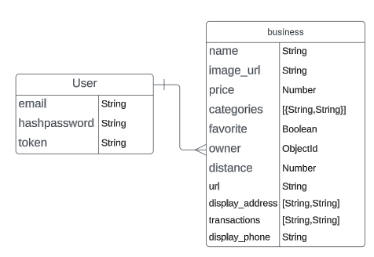
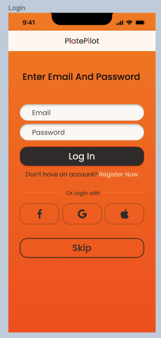
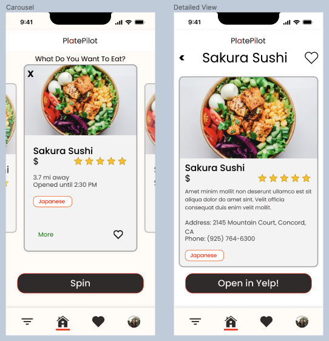
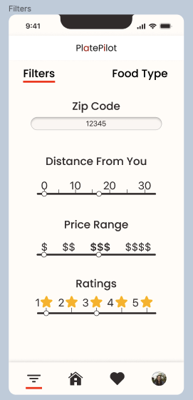
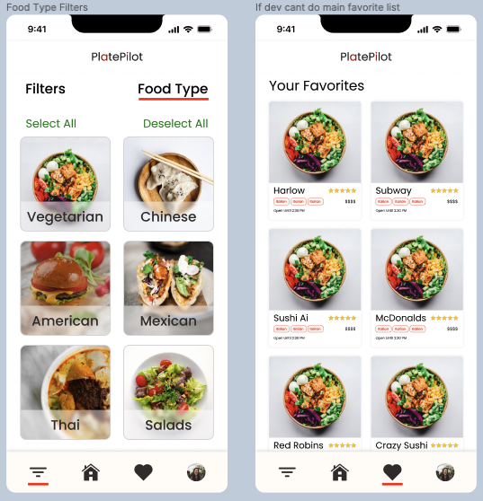

#  Plate Pilot Mobile App (iOS and Android)

This is th frontend and backend for the full stack Plate Pilot App

## New Architecture

We had to rethink how Native Modules and Native Components work. This led us to develop the Pillars of the New Architecture:

- The New Native Module System - Turbo Modules, a framework to support efficient and flexible integration with native code
- The New Native Renderer - Fabric, which offer improved capabilities, cross-platform consistency, and performance in rendering
- The Codegen, which generates boilerplate C++ required by the New Architecture via static typing in JavaScript

## Technologies Used

- Expo Go
- MongoDB
- React Native
- Node.js


## Planning section


### ERD



### Wireframes







## API

Scripts are included in [`curl-scripts`](curl-scripts) to test built-in actions. Feel free to use Postman for testing, using the curl scripts listed below and in the folder for setting up headers and request bodies.
Add your own scripts to test your custom API.

### Authentication

| Verb   | URI Pattern            | Controller#Action |
|--------|------------------------|-------------------|
| POST   | `/sign-up`             | `users#signup`    |
| POST   | `/sign-in`             | `users#signin`    |
| PATCH  | `/change-password/` | `users#changepw`  |
| DELETE | `/sign-out/`        | `users#signout`   |

### businesses

| Verb   | URI Pattern            | Controller#Action |
|--------|------------------------|-------------------|
| GET   | `/businesses`             | `businesses#index`    |
| GET   | `/businesses/<place_id>`    | `businesses#show`    |
| POST   | `/businesses`             | `businesses#create`    |
| PATCH  | `/businesses/<place_id>` | `businesses#update`  |
| DELETE | `/businesses/<place_id>`        | `businesses#delete`   |


#### Recommended Request bodies

Request - users#signup:

```json
{
    "credentials": {
      "email": "an@example.email",
      "password": "an example password",
      "password_confirmation": "an example password"
    }
}
```

Request - businesses#create (requires a token):

```json
{
    "business": {
        "title": "restaurant name",
        "desc": "this is a business to eat",
        // ...
        
    }
}
```

### Token Auth Strategy

Send the token as `Bearer Token <token>`